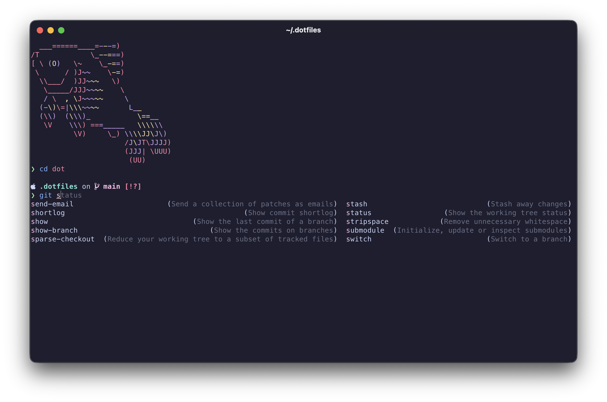

# dotfiles

A repo to store my dotfiles, a comprehensive install script, and a bit more

## Contents

- `install.sh`: Installs dotfiles and other packages (if specified)
- `.zshrc`: Zsh config
- `.zprofile`: Zsh profile
- `.vimrc`: Vim config
- `.p10k.zsh`: Powerlevel10k config
- `.gitignore_global`: Global gitignore file
- `.condarc`: Conda config
- `.config/bat/`: Config for the `bat` command (cat with catppuccin themed syntax highlighting)
- `.config/btop/`: Config for the `btop` command (better top, also with catppuccin theme)
- `.config/lazygit/`: Config for the `lazygit` command (with catppuccin theme)
- `.config/fish/`: Config for fish shell
- `.config/starship.toml`: Config for starship prompt
- `.config/zed/`: Config for [zed](https://zed.dev/) editor (with catppuccin theme and MesloLGS NF font set)
- `.config/ghostty/`: Config for ghostty terminal emulator
- `scripts`: Folder for miscellaneous useful scripts
- `macOS`: Folder for macOS specific install scripts and icons
- `backup`: Folder for old scripts

## Requirements

- `git`: To clone this repo
  Link to oh-my-zsh
- `curl`: To install [`oh-my-zsh`](https://ohmyz.sh/)

## What it does



- Installs [`oh-my-zsh`](https://ohmyz.sh/)

  - Installs the [`zsh-autosuggestions`](https://github.com/zsh-users/zsh-autosuggestions) plugin
  - Installs the [`zsh-syntax-highlighting`](https://github.com/zsh-users/zsh-syntax-highlighting) plugin

- Installs [`powerlevel10k`](https://github.com/romkatv/powerlevel10k) theme for `oh-my-zsh`

  - Install the following Meslo Nerd Fonts for best results in the terminal:
  - [MesloLGS NF Regular.ttf](https://github.com/romkatv/powerlevel10k-media/raw/master/MesloLGS%20NF%20Regular.ttf)
  - [MesloLGS NF Bold.ttf](https://github.com/romkatv/powerlevel10k-media/raw/master/MesloLGS%20NF%20Bold.ttf)
  - [MesloLGS NF Italic.ttf](https://github.com/romkatv/powerlevel10k-media/raw/master/MesloLGS%20NF%20Italic.ttf)
  - [MesloLGS NF Bold Italic.ttf](https://github.com/romkatv/powerlevel10k-media/raw/master/MesloLGS%20NF%20Bold%20Italic.ttf)
  - You can also install the fonts by running the following script:

  ```bash
  cd ~/.dotfiles/scripts
  ./install_fonts.sh
  ```

- Installs the [catppuccin_mocha](https://github.com/catppuccin/vim) theme for `vim`

- Copies dotfiles to the home directory
  - Backs up existing dotfiles if they exist
  - Backups can be found in the home directory with the extension `.bak`

## Installation

- Running the following commands will clone this repo and run the install script

```bash
cd ~
git clone https://github.com/ajholzbach/dotfiles.git ~/.dotfiles
cd ~/.dotfiles
./install.sh
```

### Optional

- To install the recommended fonts for `powerlevel10k`, run the following script:

```bash
cd ~/.dotfiles/scripts
./install_fonts.sh
```

## Removal

- This will remove the dotfiles and restore the backups (if they exist) and restore original files from backups

```bash
cd ~/.dotfiles
./install.sh -r
cd ..
rm -rf .dotfiles
```
