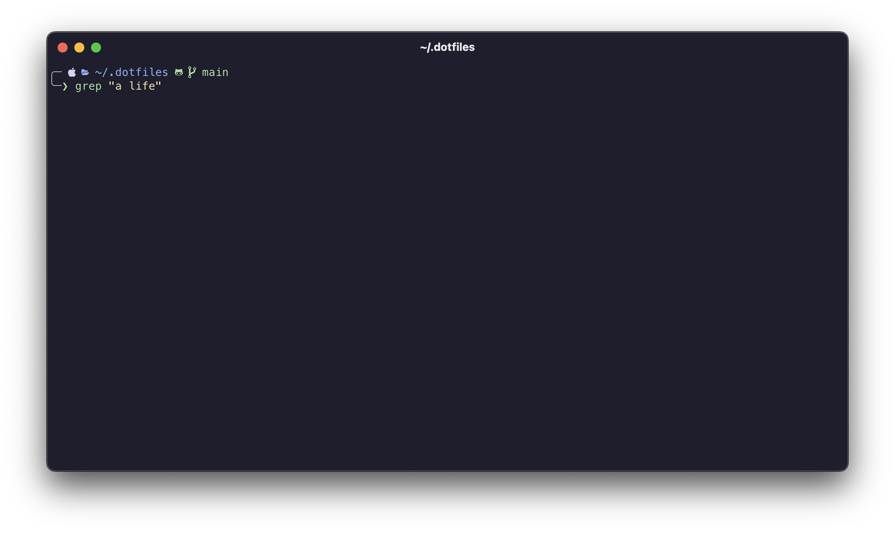

# dotfiles

Personal dotfiles managed with [Chezmoi](https://github.com/twpayne/chezmoi). The active, up-to-date configuration lives under `home/` and is applied to `$HOME` via Chezmoi.



## Status

This repository is fully managed by Chezmoi. All active dotfiles are in `home/` and automatically applied to `$HOME`.

## Layout

- `home/`: Source of truth for dotfiles used by Chezmoi (mirrors `$HOME` layout)
- `home/.chezmoiscripts/`: Automated installation scripts for fonts, Starship, Antidote, Fish plugins, etc.
- `tests/`: Docker-based test suite for Ubuntu installation validation
- `macOS/`: macOS-specific utilities (icons, optional install scripts)
- `assets/`: Screenshots and images for documentation
- `archive/`: Historical reference - old dotfiles, installers, and scripts before Chezmoi migration

## What's Included

The `home/` directory contains the following dotfiles and configurations:

### Shell Configuration
- **zsh**: Custom `.zshrc` with performance optimizations (lazy-loading for conda, nvm, pnpm), tool integrations, and Catppuccin theme support. Loads plugins via [Antidote](https://github.com/mattmc3/antidote) (`.zsh_plugins.txt`).
- **bash**: `.bashrc` sources `~/.profile`, the per-machine env file, and initializes Starship.
- [**fish**](https://github.com/fish-shell/fish-shell): Full Fish shell configuration with the Fisher plugin manager. Plugins listed in `dot_config/fish/fish_plugins`. The `ajholzbach/fish` plugin provides lazy-load function shims (cat -> bat, cd -> zoxide, conda, fzf, etc.) installed into `~/.config/fish/functions/` at `fisher update` time.
- [**xonsh**](https://xon.sh/): Python-powered shell. `dot_config/xonsh/rc.xsh` mirrors the fish setup, with a `tool-requirements.txt` for the uv-managed Python env and a `rc.d/` for drop-in scripts (`git-aliases.xsh`, lazy-loading `conda.xsh`). xonsh itself is installed externally via `uv tool install 'xonsh[full]' --with-requirements ~/.config/xonsh/tool-requirements.txt`, not by the bootstrap scripts.
- **shared `.profile`**: POSIX-clean env (XDG paths, PATH bootstrap, EDITOR, etc.) sourced by both bash and zsh.

### Per-machine local env
Any machine-specific exports (work tokens, internal credentials, per-host overrides) live in `~/.config/local-env.sh` (POSIX) and `~/.config/local-env.fish` (fish), **outside this repository**, mode 600. All four shell rcs source the appropriate one if present, so the same dotfiles work across machines without leaking machine-local values into git. Populate however suits the machine: plain `export ...`, 1Password/Bitwarden CLI lookups, decrypting an [age](https://github.com/FiloSottile/age) file, etc.

### Development Tools
- **git**: Global `.gitignore` with common ignore patterns (wired up by the `30-final-setup` script via `git config core.excludesfile`).
- **vim**: Custom `.vimrc` with Catppuccin Mocha colorscheme.
- [**starship**](https://starship.rs/): Cross-shell prompt with custom symbols, OS detection, and a shared `starship.toml` in `dot_config/`.
- [**bat**](https://github.com/sharkdp/bat): Syntax highlighting configuration with Catppuccin Mocha theme.
- [**zoxide**](https://github.com/ajeetdsouza/zoxide): Smart directory jumping (aliased to `cd` in every shell via per-shell init).
- [**mise**](https://mise.jdx.dev/): Development environment manager integration (auto-activated in zsh / fish / xonsh). Shared settings live in `dot_config/mise/conf.d/00-baseline.toml`. Per-machine `[tools]` lives in `~/.config/mise/config.toml`, which is intentionally untracked so `mise use -g` writes there freely without creating chezmoi drift.
- [**conda**](https://github.com/conda-forge/miniforge): Lazy-load setup for fast shell startup; xonsh wraps `conda shell.xonsh hook` so a fresh shell doesn't pay the ~720 ms init cost until the first `conda` invocation.
- [**fzf**](https://github.com/junegunn/fzf): Fuzzy finder, set up in zsh / fish with Catppuccin Mocha colors.

### Applications
- [**Ghostty**](https://ghostty.org/): Terminal emulator configuration (Catppuccin Mocha theme, MesloLGS Nerd Font, `display-p3` colorspace).
- [**Zed**](https://zed.dev/): Text editor settings.
- [**tmux**](https://github.com/tmux/tmux/wiki): Terminal multiplexer config in `dot_config/tmux/`.
- [**cmux**](https://github.com/manaflow-ai/cmux): macOS-native multiplexer config in `dot_config/cmux/`.
- [**btop**](https://github.com/aristocratos/btop): System monitor (themes only, per-machine `btop.conf` stays local).

All configurations use the [**Catppuccin Mocha**](https://catppuccin.com/palette/) theme for consistent visual experience across tools.

## Install (Linux or macOS)

- One-liner:

```bash
sh -c "$(curl -fsLS get.chezmoi.io/lb)" -- init --apply ajholzbach
```

- With Homebrew:

```bash
brew install chezmoi
chezmoi init --apply ajholzbach
```

This will clone the repo as a Chezmoi source and immediately apply the files from `home/` into your `$HOME`. The bootstrap scripts in `home/.chezmoiscripts/` then run, in order:

1. `05-install-homebrew` (macOS only): installs Homebrew if absent.
2. `10-install-fonts`: installs the MesloLGS Nerd Font (Homebrew cask on macOS, tarball on Linux).
3. `12-install-starship`: installs the Starship prompt.
4. `15-install-antidote`: clones [Antidote](https://github.com/mattmc3/antidote) into `~/.antidote` for zsh plugin management.
5. `16-sync-fish-plugins`: installs [Fisher](https://github.com/jorgebucaran/fisher), syncs the plugins in `dot_config/fish/fish_plugins`, and applies the Catppuccin Mocha fish theme. Re-runs whenever the plugin list or theme file changes.
6. `18-install-mise-tooling`: installs `usage` for mise completions.
7. `20-install-shell-completions`: generates fish completions for `chezmoi`, `mise`, `bat`, `rg`, `fd`, `orb`.
8. `30-final-setup`: points `git config core.excludesfile` at `~/.gitignore_global` and primes the `bat` cache.

Each script is a Go-templated bash file that gates on `.chezmoi.os` so the same source works on macOS and Linux.

## Recommended Packages

To get the full experience from these dotfiles, consider installing these optional packages:

### Essential Tools

#### [Starship](https://starship.rs/) (Cross-shell prompt)
**Installed automatically by Chezmoi scripts.** Provides the customized prompt with OS detection, git status, and development environment info.

#### [Fish Shell](https://github.com/fish-shell/fish-shell)
**Why**: Modern shell with excellent autocompletion and scripting. Includes full configuration with Fisher plugin manager.
```bash
# macOS
brew install fish

# Linux
# Follow instructions at https://fishshell.com/
```

#### [Mise](https://mise.jdx.dev/) (Development Environment Manager)
**Why**: Manages development tool versions (Node.js, Go, Java, etc.) and installs.
```bash
# macOS
brew install mise

# Linux
curl https://mise.run | sh
```

### Quality of Life Improvements

#### [Bat](https://github.com/sharkdp/bat) (Enhanced cat)
**Why**: Syntax highlighting and Git integration for file viewing. Pre-configured with Catppuccin theme. Aliased to `cat` in every shell.
```bash
# macOS
brew install bat

# Linux
mise use -g bat
```

#### [Zoxide](https://github.com/ajeetdsouza/zoxide) (Smart cd)
**Why**: Learns your directory usage patterns and provides fast navigation. Aliased to `cd` in every shell.
```bash
# macOS
brew install zoxide

# Linux
mise use -g zoxide
```

#### [Xonsh](https://xon.sh/) (Python-powered shell, optional)
**Why**: Hybrid Python/shell syntax for when you want real Python objects in your pipelines. Side-by-side with fish; not a login shell.
```bash
# Recommended: uv tool install (cross-platform, isolated)
uv tool install --managed-python 'xonsh[full]' \
  --with-requirements ~/.config/xonsh/tool-requirements.txt
```

#### [gawk](https://www.gnu.org/software/gawk/) (faster zsh startup)
**Why**: antidote probes for `gawk` at shell startup via `gawk --version`. When gawk isn't on PATH, zsh scans every PATH entry before falling back to BSD `awk`, wasting ~10 ms per shell. Installing gawk shortcuts the probe and is useful for GNU-awk scripts in general.
```bash
# macOS
brew install gawk

# Linux
# Usually preinstalled. Otherwise:
sudo apt install gawk     # Debian/Ubuntu
sudo dnf install gawk     # Fedora
```

### Post-Install Setup
After installing Fish, run once to set it as your default shell:
```bash
# Add fish to valid shells and set as default
echo $(which fish) | sudo tee -a /etc/shells
chsh -s $(which fish)
```

If you want machine-local environment (work tokens, per-host overrides, etc.), create `~/.config/local-env.sh` and `~/.config/local-env.fish` with `chmod 600`. The shell rcs source whichever one matches:
```bash
# minimum-viable example, replace with whatever fits the machine
echo 'export MY_TOKEN=...' > ~/.config/local-env.sh && chmod 600 ~/.config/local-env.sh
echo 'set -gx MY_TOKEN ...' > ~/.config/local-env.fish && chmod 600 ~/.config/local-env.fish
```

## Testing

Test the dotfiles installation on Ubuntu using Docker:

```bash
./tests/test.sh
```

See `tests/README.md` for details.

## Notes

- Legacy files from pre-Chezmoi setup are archived in `archive/` for reference only.
- All active configuration is managed through `home/` and Chezmoi.
- Machine-local env (secrets, work creds, per-host overrides) lives in `~/.config/local-env.{sh,fish}` (out of this repo, mode 600). The shell rcs source it if present.
- xonsh-specific package management uses `~/.config/xonsh/tool-requirements.txt` as the source of truth for what's installed alongside xonsh in its uv tool env. Rebuild after editing with:
  ```bash
  uv tool install --reinstall --managed-python 'xonsh[full]' \
    --with-requirements ~/.config/xonsh/tool-requirements.txt
  ```
